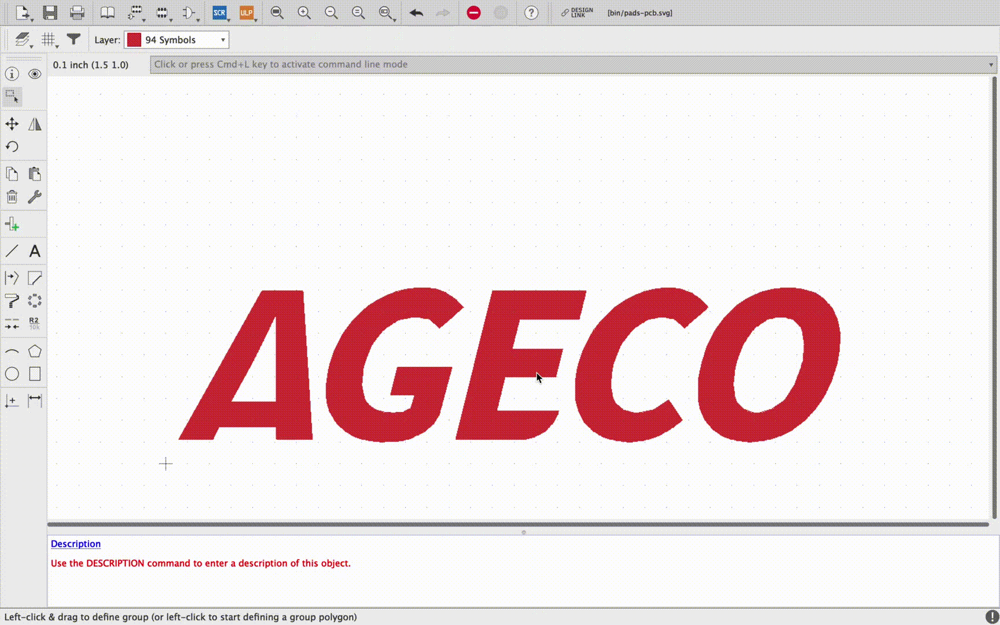

# EAGLE Scale Polygons

Autodesk EAGLE User Language Programs (ULPs) to scale all polygons of a symbol.

This ULP program must run in the context of a symbol drawing.

A copy of the polygons is created right above the original.

The new drawing is created in the current layer.

